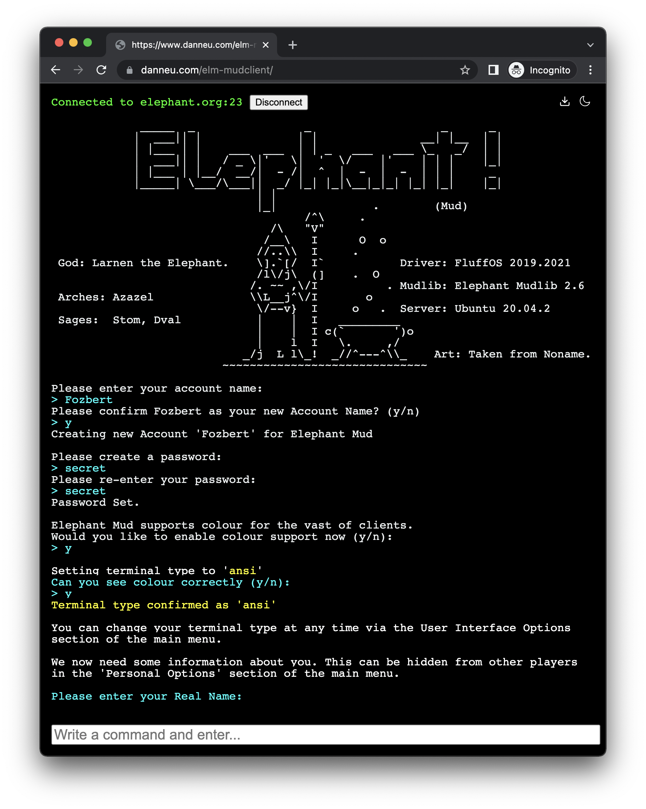

# elm-mudclient

Online demo: <https://www.danneu.com/elm-mudclient/>

A just-for-fun weekend project that implements a [MUD](https://en.wikipedia.org/wiki/MUD) gaming
web-browser client in [Elm](https://elm-lang.org/) that talks to telnet MUD servers
through a telnet<->websocket proxy server.



## Why?

- Just for fun. Doubt I'll work on it after this weekend.
  This project idea simply had enough moving parts to be fun,
  and adding polish/features in Elm is also fun.
- I sometimes spend a month playing one of the MUDs in
  Spanish just to practice Spanish. Would be fun to use
  this client and then build features as I want them. 

## How?

- `src/Main.elm` contains the Elm browser client
- `telnet-proxy/index.ts` implements the websocket<->telnet bridge server (hackjob)
- `telnet-proxy/parser.ts` implements a streaming telnet code parser (hackjob)

The Elm client opens a WebSocket to the telnet proxy which opens a TCP socket to a telnet server.

The Elm client is ignorant of WebSocket and telnet specifics. It just sends and receives strings over ports.

## Progress / features

- Basically works
- Supports MCCP2 (i.e. server-only) compression
- Provides local history download

## Feature wishlist

- Usable on small/mobile clients
- Manage multiple servers with tabs
- Implement aliases and triggers that are saved locally or even synced somehow
- Support more MUD-specific telnet options like MCCP3
- Implement prev/next history

## Run client locally

This github repo ships with pre-built assets found in the `dist/` folder.

Just serve the directory with any http server. Here are a bunch of one-liners for doing that: <https://gist.github.com/willurd/5720255>.

It will connect to my demo telnet-proxy server by default. If you want to run the telnet-proxy locally, the client UI has a text field that lets you provide another proxy URL like `ws://localhost:8080`.

## Run telnet-proxy locally

You just need Node.js installed.

```shell
git clone <thisrepo>
cd telnet-proxy
npm install
npm run build # Run typescript compiler
node index.js # Run server
# listening on :8080
```

## Develop client locally

```shell
git clone <thisrepo>
cd mudclient
npm install
npm run dev # Runs http dev server that auto-compiles source files
# listening on :1234
```

## Notes about telnet-proxy

- Responds to all {DO,DONT,WILL,WONT} negotiation with DONT
- Hosted at <ws://telnet-proxy.fly.dev> (free tier) only for demo purposes.

## Notes to self

- Simple telnet client: https://gist.github.com/legnaleurc/7638738
